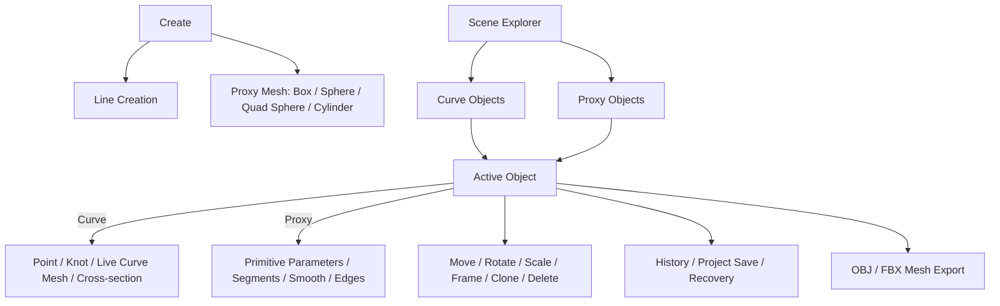

# Proxy Mesh · Object-aware Modify 구현 계획

> 구현 상태: 2026-08-08 기준 1–7단계 완료. 현재 동작 계약과 코드 지도는 [`features/proxy-mesh.md`](features/proxy-mesh.md)를 우선한다. 이 문서는 도입 당시 IA와 단계별 의사결정 기록이다.

## IA thesis

사용자는 기능보다 **현재 선택한 장면 오브젝트**를 기준으로 편집한다. 상위 탭은 Create·Modify·Display·Export로 안정적으로 유지하고, 복잡한 파라미터는 Modify에서 Curve 또는 Proxy Mesh 선택 문맥에 맞게만 노출한다.

주 정리 원칙은 **Object-first**다. Create는 생성 작업, Scene Explorer는 오브젝트 탐색, Modify는 active object 상세, Display와 Export는 장면 단위 작업을 소유한다.

## App map



## Navigation rules

- Create에서 `Line`과 네 Proxy primitive를 생성한다. Proxy는 현재 Orbit target에 기본 크기로 생성한다.
- Scene Explorer는 `Curve Objects`와 `Proxy Objects`를 별도 collection으로 보이되 두 목록 중 하나의 active object만 유지한다.
- Modify의 공통 헤더는 active object의 이름과 종류를 보여준다. 본문은 `Curve context | Proxy context | No selection`중 하나만 보여준다.
- 상단 W/E/R, Transform Space, Clone, Frame, Delete는 active Curve/Proxy 공통 명령이다. Point/Handle 명령은 Curve context에서만 활성화한다.
- Display는 전역 보기 정책을, Export는 생성된 Hair Mesh와 표시 중인 Proxy topology의 출력을 소유한다.

## Labeling rules

```yaml
entities: Curve, Proxy Mesh, Reference Model, Reference Image
proxy_types: Box, Sphere, Quad Sphere, Cylinder
actions: Create, Modify, Frame, Clone, Delete, Export
parameters:
  box: Width, Height, Depth, Width Segs, Height Segs, Depth Segs
  sphere: Radius, Segments, Rings
  quad_sphere: Radius, Face Segs
  cylinder: Radius, Height, Sides, Height Segs, Cap Segs
```

`GeoSphere`라는 이름은 3ds Max에서 삼각형 기반을 뜻할 수 있으므로, 사용자가 요청한 사각형 기반 스피어는 UI에서 `Quad Sphere` 또는 `GeoSphere · Quads`로 표시한다.

## Serializable content model

```yaml
proxy:
  id: integer
  name: string
  type: box | sphere | quad-sphere | cylinder
  visible: boolean
  locked: boolean
  settings: normalized primitive parameters
  position: [x, y, z]
  quaternion: [x, y, z, w]
  scale: [x, y, z]
derived_scene_only:
  group: THREE.Group
  solidMesh: THREE.Mesh
  wireMesh: THREE.LineSegments
  topology: Vector3[] + logical faces
```

Proxy topology는 settings에서 다시 만들 수 있으므로 프로젝트 JSON에 vertex/face 배열을 중복 저장하지 않는다. 이전 문서에 `proxies`가 없으면 빈 배열로 복원하는 optional 필드로 추가한다.

## Geometry contract

- Box는 면별 subdivision을 가진 사각 face topology다.
- Sphere는 위경도 기반으로 중간은 quad, 극은 triangle이다.
- Quad Sphere는 subdivided cube를 반지름에 투영하며 모든 face가 quad다.
- Cylinder side는 quad, cap은 첫 ring의 triangle과 추가 radial quad ring으로 구성한다.
- 설정은 DOM 밖 순수 모듈에서 유효 범위와 최대 face 예산을 제한한다. HTML min/max만 신뢰하지 않는다.
- 렌더러는 logical quad/ngon을 삼각분할하지만 프로젝트 파생 상태와 OBJ/FBX Export는 원래 face를 유지한다.

## Implementation phases

1. `src/geometry/proxy-primitives.js`: 기본값, 정규화, Box/Sphere/Quad Sphere/Cylinder topology, stats와 Node 경계 테스트.
2. Runtime record: `proxyRoot`, `proxies`, `selectedProxy`, create/rebuild/dispose, 선택 wire 표시.
3. UI: Create primitive 버튼, Proxy Objects 목록, object-aware Modify context와 파라미터 입력.
4. Interaction: Viewport picking, W/E/R gizmo, Frame/Clone/Delete, visibility/lock, History transaction.
5. Persistence: optional proxy state, active object kind/id, Undo/Redo/Recovery/project round-trip.
6. Export: ready Hair topology와 visible Proxy topology를 공통 export entry로 OBJ/FBX에 포함.
7. Validation: 모든 primitive 생성, 세그먼트 최소/증가, Modify context 전환, gizmo, Undo/Redo, 저장 왕복, 1024px 레이아웃, OBJ/FBX 정적 구조.

## Acceptance gates

- 네 primitive가 기본 파라미터로 생성되고 Scene Explorer·Viewport에서 양방향 선택된다.
- 크기 또는 segment 수치를 바꾸면 당장 topology·wire·polygon stats가 갱신되며 한 연속 입력이 한 Undo로 복원된다.
- Curve 선택에서 기존 Point/Live Mesh Modify가, Proxy 선택에서 Primitive Parameters만 보인다.
- Proxy의 Move/Rotate/Scale, Clone, Delete, visibility, lock, Frame이 Curve 작업을 오염시키지 않는다.
- 구 프로젝트는 그대로 열리고, 새 프로젝트는 Proxy 파라미터·transform·선택을 왕복한다.
- Export에서 Quad Sphere와 subdivided Box의 logical quad face가 유지된다.

## 완료 검증 기록

- Node `npm run check`: 21/21 계약 통과. 4종 parameter clamp, 예상 vertex/face/quad/render triangle 수와 outward face winding 포함.
- Browser self-test: 24/24 통과.
- 1600×900: Box 생성 → 축별 Segments 변경 → Quad Sphere 변환 → Clone → Undo/Redo → Project Save → OBJ 2-object 출력 확인.
- 실제 canvas 입력으로 Proxy X축 gizmo drag 후 OBJ world vertex 평균 X 이동, Curve↔Proxy 선택에 따른 Modify 문맥 전환, Show Edges/Smooth 왕복과 Frame을 확인.
- 1024×768: 4종 생성, Cylinder Sides/Height/Cap Segments 변경, lock 편집 차단, Delete 후 Project Open 복원, FBX 4 Model 출력과 패널 clipping 없음 확인.
- 남은 외부 검증: FBX는 실험 기능이므로 최종 호환 판정 전에 3ds Max/Blender Import가 필요하다.
